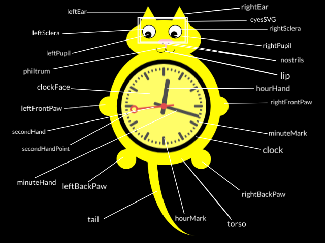

# What Time is Meow?

Repository to extend a project started on Codepen, in order to safeguard it from the possibility of my cats stepping on the keyboard at an inopportune time and losing all of my code.

**Cat Diagram**



## Default Properties

Default options for the appearance of generated cats can be found and altered in [defaultOptions.js](./src/utils/defaultOptions.js);

Originally set defaults are as follows:

```javascript
const defaultOptions = {
  // Entire page
  backgroundColor: "black",
  cursor: `url("mouse.png"), auto`,
  // Eyes
  browRidgeHeight: "90px",
  eyesSVGPosition: "fixed",
  eyesSVGHeight: "100px",
  eyesSVGWidth: "120px",
  eyesSVGPaddingTop: "5px",
  eyesSVGPaddingLeft: "35px",
  pupilColor: "black",
  leftScleraColor: "white",
  rightScleraColor: "white",
  rightPupilColor: "white",
  leftPupilColor: "white",
  scleraColor: "white",
  scleraOutlineWidth: 2,
  scleraOutlineColor: "#000",
  // Arms
  leftFrontPawSize: "50px",
  leftFrontPawRadius: "80%",
  leftFrontPawMarginRight: "-25px",
  rightFrontPawSize: "50px",
  rightFrontPawRadius: "80%",
  rightFrontPawMarginLeft: "-30px",
  // Legs
  leftBackPawHeight: "50px",
  leftBackPawWidth: "50px",
  leftBackPawBorderRadius: "50%",
  leftBackPawMarginTop: "-40px",
  rightBackPawHeight: "50px",
  rightBackPawWidth: "50px",
  rightBackPawBorderRadius: "50%",
  rightBackPawMarginTop: "-40px",
  // Cat
  catMargin: "auto",
  catWidth: "380px",
  catColor: "yellow",
  // Ears
  leftEarHeight: "70px",
  rightEarHeight: "70px",
  // Clock
  clockHeight: "300px",
  clockWidth: "300px",
  clockFaceColor: "rgb(255, 255, 255, 0.3)",
  secondHandPointColor: "purple",
  clockOutlineColor: "black",
  secondHandColor: "#D40000",
  minuteHandColor: "black",
  hourHandColor: "black",
  minuteMarksColor: "black",
  hourMarkColor: "black",
  // Head
  headWidth: "50%",
  headHeight: "100px",
  headBorderRadius: "50%",
  headMargin: "-30px auto",
  // Nose
  noseWidth: "40px",
  noseHeight: "12px",
  noseColor: "pink",
  noseBorderRadius: "20px / 10px",
  noseMargin: "-40px auto auto calc(50% - 15px)",
  nostrilMarginTop: "7px",
  nostrilHeight: "2.5px",
  nostrilWidth: "2.5px",
  nostrilColor: "black",
  nostrilBorderRadius: "50%",
  philtrumHeight: "10px",
  philtrumWidth: "5px",
  philtrumMargin: "0 calc(50% + 3px)",
  // Mouth
  lipWidth: "22px",
  lipHeight: "10px",
  lipBottomLeftRadius: "15px",
  lipBottomRightRadius: "15px",
  lipBorder: ".5px solid black",
  lipBorderTop: "0",
  mouthMargin: "auto 23% auto auto",
  // Torso
  torsoHeight: "300px",
  torsoWidth: "75%",
  torsoBorderRadius: "50%",
  // Tail
  tailRightBorderWidth: "40px",
  tailBottomBorderWidth: "0px",
  tailWidth: "230px",
  tailHeight: "200px",
  tailMarginRight: "230px",
  tailCurve: "200px",
  tailMarginTop: "-30px"
};
```

## To Create a Cat

In index.js:

1. Initialize a cat factory by intiantiating a new CatFactory class (e.g., `let catFactory = new CatFactory()`)
2. Start creating cats using the `create` method on `CatFactory`! (Be sure to add them to the `catList` array)

### To Create a Cat with a Specific Timezone

Pass a timezone description as the first argument to `create` function.

### To Style a Cat on Creation

Pass an object of style descriptions as the second argument to `create` function.

### To Style a Cat After Creation

Access the cat you'd like to style, then call `addStyles` on that cat, passing in a style object like you would during cat creation.

### Digital Clock Mode

In order to configure a cat to use a digital clock rather than an analog one, pass `{digitalClock: true}` to the create function.

The border color maps to `defaultOptions.clockOutlineColor`. The background color maps to `defaultOptions.clockFaceColor`. The color for the numbers associated with the hour are mapped to `defaultOptions.hourHandColor`. The color for the numbers associated with the minute are mapped to `defaultOptions.minuteHandColor`. The color for the numbers associated with the second are mapped to `defaultOptions.secondHandColor`.

You can opt to use military time (24-hour) by passing `{militaryTime: true}` to the create function.

## Example Usage

In index.js:

```javascript
// Initialize the cat factory
let catFactory = new CatFactory();

// Create whatever cats you'd like, passing in whatever options you'd like
let localCat = catFactory.create();
let sidneyCat = catFactory.create(`Australia/Sydney`, { catColor: "green" });
let londonCat = catFactory.create("Europe/London", { catColor: "red" });
let berlinCat = catFactory.create("Europe/Berlin", {
  catColor: "rebeccapurple",
  tailColor: "green"
});

// Cats pushed to an array in order to access them by index
catList.push(localCat);
catList.push(sidneyCat);
catList.push(londonCat);
catList.push(berlinCat);

catList[2].addStyles({
  leftEyeColor: "blue",
  minuteMarkColor: "grey",
  headColor: "fuchsia"
});
catList[1].addStyles({
  leftBackPawColor: "red",
  secondHandColor: "white",
  clockFaceColor: "rgb(23, 25, 22, 0.3)"
});
```

### Notes

#### Clock Height and Clock Width

This template changes the clockWidth and clockHeight after initializing the defaultOptions object (alterations can be found in the [defaultOptions.js](./src/utils/defaultOptions.js) file) in order to check if the digitalClock mode is activated or not -- the width and height are different in analog and digital modes.

#### Screen Sizes

In order to reduce the friction of the animation on smaller screens, screens smaller than 600px wide have animation aside from the clock disabled.
